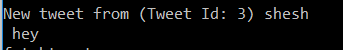

**Twitter Clone**

This project aims at creating an engine which provides basic Twitter
like features. The project uses Concache to store all the data which is
a wrapper over ETS. These features include:

1.  Registration/Signup of new user.

2.  Login of registered user

3.  Force login if the user is already logged in from somewhere else.

4.  Tweet by logged in user

5.  Following/Subscribing a registered user.

6.  Retweet

7.  Logout

8.  Query tweets subscribed to.

9.  Query to find all the registered user.

10. Query to find all the tweets with a mention of given user.

11. Query to find all the tweets with a given hash tag.

12. Delivers the tweet/retweet to the followers immediately, if they are
    logged in.

13. Delivers the tweet to the user mentioned in the tweet immediately,
    if the user is logged in.

    Each feature is described below:

<!-- -->

1.  **Registration/Signup**

    User can register by executing below command:

    register username,password

    

2.  **Login**

    A registered user can login using the username and password. The
    command to login is:

    login username,password

    

3.  **Forced Login**

    If a user is already logged in and tries to create a different
    session, he needs to quit from the old session. This feature allows
    user to invalidate the old user session and create new session. The
    command to login forcefully is:

    login username,password,force

    

4.  **Tweet**

    A logged in user can tweet, which will be delivered to all
    his/her followers. Tweet can contain mentions of registered users
    and if the mentioned user is logged in, he/she will receive the
    tweet immediately. Tweet can also contain hash tags. The command to
    tweet is:

    tweet message

    

5.  **Following a registered user**

    A user can subscribe to the tweets of existing users using
    this feature. This will allow user to receive the tweets from the
    registered user to be received immediately if logged on or can be
    queried later to fetch the tweet subscribed to. The command to
    subscribe a user is:

    subscribe username

    

6.  **Retweet **

    This feature allows user to retweet the existing tweets. The command
    for retweet is:

    retweet tweet\_id

    

7.  **Logout**

    This feature allows user to logout from the existing session. User
    can use below command to logout:

    logout

    

8.  **Query tweets subscribed to.**

    This feature allows user to fetch the tweets from the users which
    he/she is subscribed to. If the user does not have any tweets, it
    will display blank. The command for the same is:

    fetchtweets

    

9.  **Query to find all the registered user.**

    This feature allows user to fetch list of all registered users. The
    command for this is below:

    fetchusers

    

10. **Query to find all the tweets with a mention of given user.**

    This feature returns all the tweets where the given user
    was mentioned. The command is below:

    fetchmention username

    

11. **Query to find all the tweets with a given hash tag.**

    This feature returns all the tweets containing the given hashtag.
    The command is below:

    fetchtag hashtag

    

12. **Delivers the tweet/retweet to the followers immediately, if they
    are logged in.**

    

    

13. **Delivers the tweet to the user mentioned in the tweet immediately,
    if the user is logged in.**

    

    **Test Simulator**

    The project is divided into two parts client and server. The default
    port for client and server is 4040. While the server starts on the
    mentioned port, client uses it to connect. The server can be started
    on different port by setting “PORT” environmental variable.

    **Note**: Make sure the port for both the client and server are set
    to same value. Default for both is 4040

    **Running the Simulator:**

<!-- -->

1.  **Server**

-   Enter into / twitter\_prototype/apps/twitter\_server/ folder

-   Run the below command:

    mix run --no-halt

This will start the server on the specified port, if mentioned else on
4040.

1.  **Client**

-   Enter into /twitter\_prototype/apps/twitter\_client/

<!-- -->

-   Run the below command:

    mix run --no-halt

1.  **The server can also be connected using telnet. Once the client is
    connected using telnet, the client can access any of the feature
    described in above section. Below is the command for accessing the
    server using telnet:**

    telnet 127.0.0.1 4040

2.  **Zipf Distribution**

    The simulator assigns each user an id starting from 1. Each user
    register and login. To attain Zipf distribution, i.e. to make one
    user more popular than other, the client uses mathematical relation
    between the user id’s. User A with id “a” follows user B with id “b”
    if the remainder when a is divided by b i.e. a%b=0. Since, all the
    client id’s is divisible by 1, all user subscribes to user with id
    1, similarly all user with even ids subscribe to 2 and so on which
    makes user 1 most popular, user 2 second most popular and so on.

| User Id | Tweet Count |
|---------|-------------|
| 1       | 18625       |
| 2       | 12872       |
| 3       | 9556        |
| 4       | 6491        |
| 5       | 3542        |
| 6       | 2437        |
| 7       | 1832        |
| 8       | 1391        |

We verified the simulator with maximum concurrent logged user count
=7000 with over 300,000 tweets.

